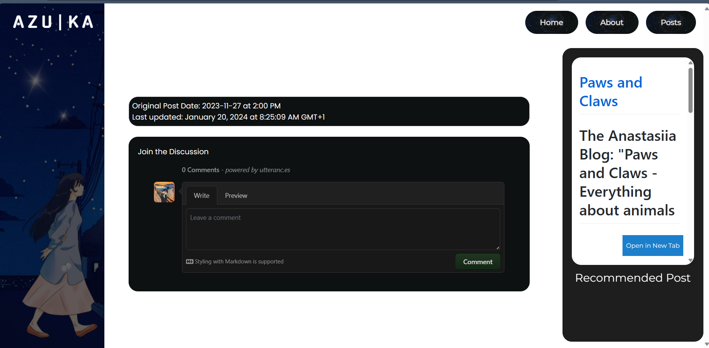
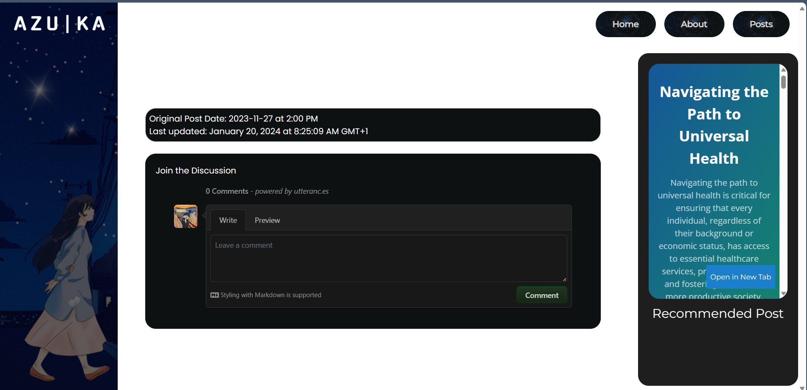

___

## WEEK FOUR (Automating reconmended random post)

___

So to provide readers seeking more in-depth information with additional resources, since my article is more adhered to human touch, the people behind the number, stripped of its technicalities, so i thought why not do a recommended post section that gives readers more option if they want more technical indepth information.

PSEUDOCODE:
Step 1- Create a shell script that extracts all the  group homepage URLs and sends them to a JSON file
Step 2- The code should be able to grab the URL and the ID section where it is supposed to pop up in the HTML layout.
Step 3- Ask chatgpt, we don't know much about javascript, just little enough to know where an error occurs or where it is coming from. Let’s not get ahead of ourselves now.

```json

#!/bin/bash

gh repo list 23W-GBAC -L 30 --json homepageUrl >> group_url.json

```
This command uses Github CLI to list repositories in the 23W-GBAC group repository and fetches information about the latest 30 repositories in this case, I experimented with 30 repositories from the GitHub organization 23W-GBAC, specifically requesting the homepage URL for each repository, and then appends this information in JSON format to a file named group_url.json I created to store the list of URLs

Then we move on to the Javascript:

```json

async function fetchHomepageUrls() {
  const response = await fetch('group_url.json');
  const data = await response.json();
  return data.map(entry => entry.homepageUrl).filter(url => url); // Filter out empty URLs
}

```
This code uses the fetch function to get data using HTTP request to the  group_url.json., and wait for a response, after receiving the response, it extracts the JSON content, Once the JSON data is obtained, the function maps over each entry in the data array and extracts the homepage URL property. Then, it filters out any empty URLs (falsy), closing the block function.

```json

function getRandomPostURL(homepageUrls) {
  const randomIndex = Math.floor(Math.random() * homepageUrls.length);
  return homepageUrls[randomIndex];
}

function openInNewTab(url) {
  window.open(url, '_blank');
}

```

These functions get random posts by taking an array of the homepage URLs of the group repository as its parameter and using math.random() to generate a random floating point number between 0 and 1 and using math.floor() to bring it down to the nearest whole number, creating random integer between 0 and the length of homepage URLs. The random index retrieves the URL at the randomly generated index, selecting a random URL from the array and the second function is to be able to open the URL in a new tab when called..In summary, the function gets a random post URL which is already in its name and selects a URL to pop up in the HTML layout.

```json

async function displayRandomPost() {
  const homepageUrls = await fetchHomepageUrls();
  const randomPostURL = getRandomPostURL(homepageUrls);
  const postContainer = document.querySelector('.reconmend');

  if (window.innerWidth < 1024) {
    // Mobile styles
    const containerHeight = window.innerHeight * 0.22; // Adjust the multiplier as needed
    const iframeHeight = containerHeight - 40; // Adjust the padding/margin as needed
    postContainer.innerHTML = `
      <div style="position: relative; width: 100%; height: ${containerHeight}px; overflow: hidden;">
        <iframe src="${randomPostURL}" width="100%" height="${iframeHeight}px" style="position: absolute; top: 0; left: 0; transform: scale(1.0); transform-origin: 0 0;"></iframe>
        <div class="recommended-text" style="text-align: center; margin-top: ${iframeHeight}px; font-family: 'Montserrat'; color: white;">
          <h3>Recommended Post</h3>
        </div>
        <button style="position: absolute; top: 10px; left: 10px; padding: 2px; height: 3vh; background-color: #3498db; color: #fff; border: none; cursor: pointer;" onclick="openInNewTab('${randomPostURL}')">Open in New Tab</button>
      </div>`;
  } else {
    // Desktop styles
    postContainer.innerHTML = `
      <div style="position: relative; width: 100%; height: 60vh; border-radius: 20px; padding-bottom: 75%; overflow: hidden;">
        <iframe src="${randomPostURL}" width="100%" height="100%" style="position: absolute; top: 0; left: 0; transform: scale(1.0); transform-origin: 0 0;"></iframe>
        <button style="position: absolute; bottom: 19px; right: 23px; height: 6vh; padding: 8px; background-color: rgb(27 127 204); color: #fff; border: none; font-family: 'Montserrat'; cursor: pointer;" onclick="openInNewTab('${randomPostURL}')">Open in New Tab</button>
      </div>
      <div class="recommended-text" style="text-align: center; margin-top: 10px; font-family: 'Montserrat'; color: white; font-size: x-large;">
        <h3>Recommended Post</h3>
      </div>`;
  }
}


window.onload = displayRandomPost;

````

The display random post function, gets a random post, assigning a random URL as stated earlier and the document. query selector selects an element with a class name “recommend”, which is the element class in my HTML blog post layout under the post container div. The div display for the iframe gives readers a window into what this recommended blog post or blog looks like, more like window shopping when you go to the mall. The downside is WhatsApp which uses phone numbers and not URLs, this is the only limitation. Whatsapp has a QR code but doesn't it give you a window to anything, you literally have to scan the QR code to check, but with the windows to the URLs, you see what you are getting or what article you want to read. The if and else are, so that the iframe can be responsive to both desktop and mobile views, the selected URL is embedded in an iframe, and a button is provided to open the URL in a new tab. Window.onload ensures random post runs when the page loads finish. See sample of random post:

Random post 1:



Random post 2:



Random post 3:


___

### [WEEK ONE](automation_one.md) | [WEEK TWO](automation_two.md) | [WEEK THREE](automation_three.md)